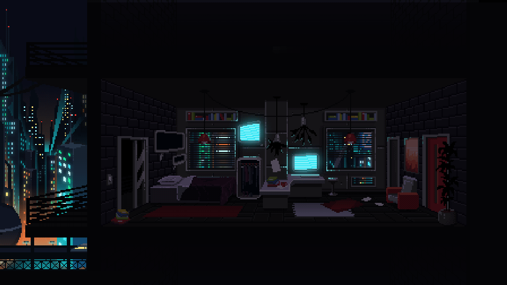

  

<h1 align="center"> I'm Valeriia Khramova</h1>

<h3 align="center">Manual QA Engineer | 3+ Years Experience | C++ / Python Developer</h3>

  

  

---

## 🚀 About Me

* 🔍 Manual QA Engineer with **3+ years of commercial experience**
* 💻 Experienced in software validation, regression testing and product quality assurance
* ⚡ Developing backend and programming expertise in **C++ and Python**
* 🧠 Strong analytical thinking and defect investigation skills
* 📈 Focused on quality, stability and product reliability

---

## 🛠 Core Technology Stack

### Languages

---

### QA & Product Tools

---

### Databases & Environment

---

## 🧪 QA Expertise

* Functional Testing
* Regression Testing
* Smoke Testing
* API Testing
* UI Testing
* Test Case Design
* Bug Reporting
* Requirements Analysis

## ⚡ Professional Focus

> Quality means delivering confidence, not just functionality.

---

## 📫 Contact

* LinkedIn: PASTE_LINKEDIN_LINK_HERE

